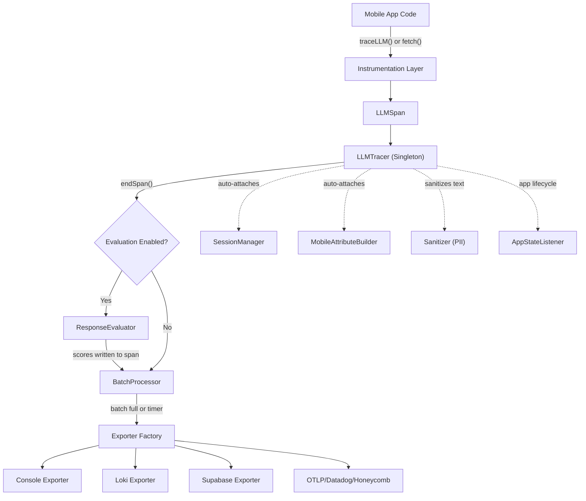
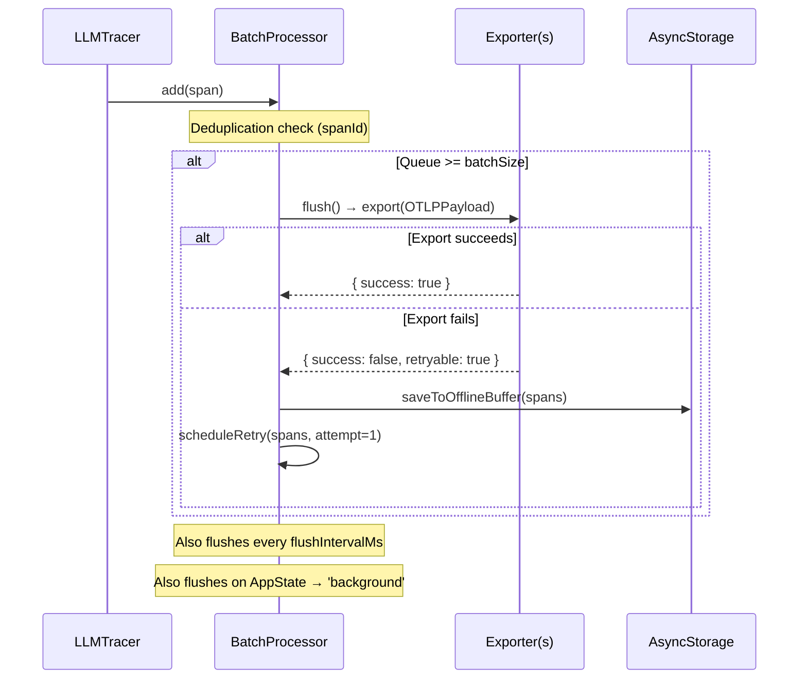
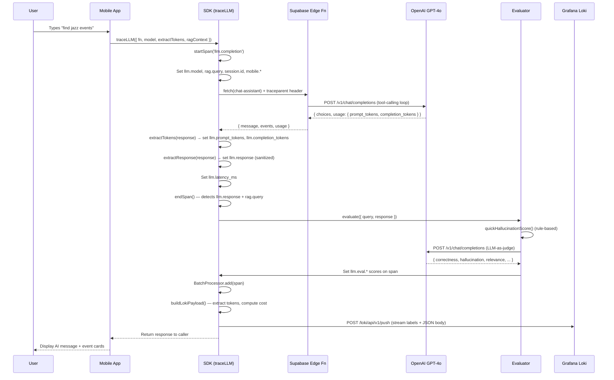

# @llm-telemetry/react-native — Integration Guide

## 1. Install

```bash
npm install @llm-telemetry/react-native
```

## 2. Initialize (once at app startup)

```typescript
import { initTelemetry } from '@llm-telemetry/react-native';

const { tracer, traceLLM, installFetchInterceptor } = await initTelemetry({
  appId: 'my-app',
  environment: 'production',

  // Loki endpoint
  exporterType: 'loki',
  lokiUrl: 'http://localhost:3100',

  // Optional: LLM-as-judge evaluation
  evaluationEnabled: true,
  evaluationApiKey: 'sk-...',
  evaluationModel: 'gpt-4o-mini',
});
```

## 3. Trace LLM calls

### Option A: Manual tracing (recommended)

Wrap any async function that calls an LLM:

```typescript
const result = await traceLLM({
  fn: async () => {
    const res = await fetch('https://api.openai.com/v1/chat/completions', {
      method: 'POST',
      headers: { Authorization: `Bearer ${key}`, 'Content-Type': 'application/json' },
      body: JSON.stringify({ model: 'gpt-4o', messages: [{ role: 'user', content: query }] }),
    });
    return res.json();
  },
  model: 'gpt-4o',
  query: 'What is the weather?',
  extractResponse: (r) => r.choices[0].message.content,
  extractTokens: (r) => ({
    promptTokens: r.usage.prompt_tokens,
    completionTokens: r.usage.completion_tokens,
  }),
});
```

### Option B: Auto-instrumentation

Intercepts all `fetch()` calls to known LLM endpoints automatically:

```typescript
installFetchInterceptor();
```

> When both are active, `traceLLM()` takes priority — the fetch interceptor skips requests already being traced.

## 4. Import the Grafana Dashboard

The SDK ships a pre-built Grafana dashboard:

```typescript
import { GRAFANA_DASHBOARD } from '@llm-telemetry/react-native';

// POST to Grafana API:
await fetch('http://localhost:3000/api/dashboards/db', {
  method: 'POST',
  headers: { 'Content-Type': 'application/json', Authorization: 'Bearer <grafana-api-key>' },
  body: JSON.stringify({ dashboard: GRAFANA_DASHBOARD, overwrite: true }),
});
```

Or copy `grafana/dashboard.json` from the package and import it manually in the Grafana UI.

## 5. What gets logged

Each request produces **one** Loki log entry with:

| Field | Description |
|---|---|
| `tokens_prompt` / `tokens_completion` / `tokens_total` | Token counts |
| `cost_total_usd` | Estimated USD cost (auto-calculated from model pricing) |
| `pipeline_duration_ms` | End-to-end latency |
| `evaluation_scores_correctness` | LLM-as-judge correctness score (0–1) |
| `evaluation_scores_relevance` | Relevance score (0–1) |
| `evaluation_scores_hallucination` | Hallucination risk (0–1, lower is better) |
| `evaluation_scores_overall` | Weighted average score |
| `eval_triggered` | `"true"` / `"false"` — stream label for filtering |

## 6. Supported Models (cost calculation)

OpenAI: `gpt-4o`, `gpt-4o-mini`, `gpt-4.1`, `gpt-4.1-mini`, `gpt-4.1-nano`, `o4-mini`
Anthropic: `claude-4-sonnet`, `claude-3.7-sonnet`, `claude-3-5-sonnet`, `claude-3-5-haiku`
Google: `gemini-2.5-pro`, `gemini-2.5-flash`, `gemini-2.0-flash`

Unrecognized models fall back to GPT-4o pricing with a dev-mode warning.

## Safety Guarantees

- **Never throws** — all telemetry is wrapped in try/catch
- **Never blocks the UI** — tracing runs in the background after `fn()` returns
- **10s grading timeout** — slow LLM-as-judge calls don't block span export
- **No duplicate logs** — `traceLLM()` and the fetch interceptor coordinate to emit exactly one log per request


---

# @llm-telemetry/react-native — Complete SDK Documentation

> **Version:** 1.0.0 · **Platform:** React Native (iOS/Android) · **Language:** TypeScript  
> **Source:** [sdk root](file:///Users/aissamamdouh/.gemini/antigravity/scratch/llm-telemetry-rn)

---

## Table of Contents

1. [Architecture Overview](#1-architecture-overview)
2. [Module Breakdown](#2-module-breakdown)
3. [Initialization & Configuration](#3-initialization--configuration)
4. [How Data Is Collected (Instrumentation)](#4-how-data-is-collected-instrumentation)
5. [What Data the SDK Captures](#5-what-data-the-sdk-captures)
6. [What Data the Mobile App Provides](#6-what-data-the-mobile-app-provides)
7. [Evaluation Pipeline](#7-evaluation-pipeline)
8. [Export Pipeline — How Data Leaves the App](#8-export-pipeline--how-data-leaves-the-app)
9. [Loki Log Format (Dashboard Query Format)](#9-loki-log-format-dashboard-query-format)
10. [Data Flow Diagram](#10-data-flow-diagram)
11. [Integration Guide](#11-integration-guide)
12. [API Reference](#12-api-reference)
13. [Configuration Reference](#13-configuration-reference)

---

## 1. Architecture Overview



The SDK is a **self-contained observability pipeline** for LLM-powered mobile apps. It:

1. **Captures** — Wraps LLM API calls (via `traceLLM()` or automatic `fetch()` interception) to record latency, tokens, cost, model, prompts, and responses.
2. **Evaluates** — Optionally runs a 2-stage evaluation pipeline (rule-based hallucination pre-score → LLM-as-judge grading) on every response.
3. **Enriches** — Automatically attaches mobile device info, session identity, and PII-sanitized text.
4. **Exports** — Batches spans into OTLP-compatible payloads and pushes them to one or more backends (Loki, Supabase, Console, OTLP-HTTP, Datadog, Honeycomb).

> [!IMPORTANT]
> The SDK never throws. Every operation is wrapped in try/catch with silent fallback. Telemetry failures must never crash the host app.

---

## 2. Module Breakdown

The SDK has **36 source files** organized into **9 modules**:

| Module | Files | Purpose |
|--------|-------|---------|
| `core/` | `tracer.ts`, `span.ts`, `id.ts`, `clock.ts`, `context.ts` | Singleton tracer, span lifecycle, ID generation, W3C trace context |
| `types/` | `index.ts` | All TypeScript interfaces, enums, OTLP payload types |
| `attributes/` | `semantic.ts`, `llm.ts`, `mobile.ts`, `rag.ts` | Semantic attribute constants (OpenTelemetry GenAI conventions) |
| `instrumentation/` | `generic-llm.ts`, `fetch-interceptor.ts`, `openai.ts`, `anthropic.ts`, `rag-pipeline.ts` | Three instrumentation methods for capturing LLM calls |
| `evaluation/` | `evaluator.ts`, `grader.ts`, `hallucination.ts`, `grounding.ts`, `prompts.ts` | 2-stage evaluation: rule-based + LLM-as-judge |
| `export/` | `loki.ts`, `supabase.ts`, `console.ts`, `otlp-http.ts`, `otlp-grpc.ts`, `datadog.ts`, `honeycomb.ts`, `multi.ts`, `batch-processor.ts`, `exporter.ts`, `enriched-log.ts` | 8 exporter backends + batch processor + factory |
| `cost/` | `pricing.ts` | Token-based USD cost calculation with per-model pricing |
| `session/` | `session-manager.ts`, `app-state-listener.ts` | Session identity (4hr timeout), background/foreground lifecycle |
| `sanitizer/` | `sanitizer.ts` | PII stripping (emails, phones, SSNs, API keys) + text truncation |

---

## 3. Initialization & Configuration

### One-Liner Setup

```typescript
import { initTelemetry } from '@llm-telemetry/react-native';

await initTelemetry({
    exporterType: 'multi',           // console + supabase + loki
    collectorUrl: 'https://your-supabase.co',
    lokiUrl: 'http://localhost:3100',
    evaluationEnabled: true,
    evaluationApiKey: 'sk-...',
    // ... see Configuration Reference below
});
```

### What Happens During `init()`

The `LLMTracer.init()` method ([tracer.ts](file:///Users/aissamamdouh/.gemini/antigravity/scratch/llm-telemetry-rn/src/core/tracer.ts)) performs these steps in order:

1. **Creates the Exporter** — Factory in [exporter.ts](file:///Users/aissamamdouh/.gemini/antigravity/scratch/llm-telemetry-rn/src/export/exporter.ts) instantiates the appropriate backend(s).
2. **Creates the BatchProcessor** — [batch-processor.ts](file:///Users/aissamamdouh/.gemini/antigravity/scratch/llm-telemetry-rn/src/export/batch-processor.ts) sets up the queue, flush timer, and retry logic.
3. **Initializes SessionManager** — [session-manager.ts](file:///Users/aissamamdouh/.gemini/antigravity/scratch/llm-telemetry-rn/src/session/session-manager.ts) loads or creates a session (4hr expiry) via AsyncStorage.
4. **Initializes Sanitizer** — [sanitizer.ts](file:///Users/aissamamdouh/.gemini/antigravity/scratch/llm-telemetry-rn/src/sanitizer/sanitizer.ts) configures PII stripping patterns and max prompt length.
5. **Initializes MobileAttributeBuilder** — [mobile.ts](file:///Users/aissamamdouh/.gemini/antigravity/scratch/llm-telemetry-rn/src/attributes/mobile.ts) reads device info (platform, OS version, app version).
6. **Initializes ResponseEvaluator** — [evaluator.ts](file:///Users/aissamamdouh/.gemini/antigravity/scratch/llm-telemetry-rn/src/evaluation/evaluator.ts) configures the LLM-as-judge grading pipeline.
7. **Starts AppStateListener** — [app-state-listener.ts](file:///Users/aissamamdouh/.gemini/antigravity/scratch/llm-telemetry-rn/src/session/app-state-listener.ts) hooks into React Native's `AppState` to flush on background and retry on foreground.

---

## 4. How Data Is Collected (Instrumentation)

The SDK offers **three instrumentation methods**. You choose one or combine them.

### Method 1: `traceLLM()` — Manual Wrapper (Recommended)

**File:** [generic-llm.ts](file:///Users/aissamamdouh/.gemini/antigravity/scratch/llm-telemetry-rn/src/instrumentation/generic-llm.ts)

Wraps any async function with a span. You provide callback functions to extract data from the response.

```typescript
const data = await traceLLM<AgentResponse>({
    fn: async () => {
        const res = await fetch('/functions/v1/chat-assistant', { ... });
        return await res.json();
    },
    model: 'gpt-4o',
    provider: 'supabase-edge',
    extractResponse: (r) => r.message,          // → sets llm.response
    extractTokens: (r) => ({                     // → sets llm.prompt_tokens, llm.completion_tokens
        promptTokens: r.usage?.prompt_tokens ?? 0,
        completionTokens: r.usage?.completion_tokens ?? 0,
    }),
    ragContext: { query: userMessage },           // → sets rag.query (triggers evaluation)
});
```

**What it does internally:**
1. Calls `tracer.startSpan('llm.completion')` — creates an `LLMSpan`.
2. Auto-attaches: `llm.model`, `llm.provider`, `llm.streaming`, `session.id`, `mobile.*` attributes.
3. Calls your `fn()` — the actual LLM API call.
4. After `fn()` resolves: measures `llm.latency_ms`, calls your `extractTokens()`, `extractResponse()`, `extractToolCalls()`, `extractRequestId()` callbacks to populate the span.
5. Sanitizes prompt/response text via the Sanitizer.
6. Calls `tracer.endSpan(span)` — this triggers evaluation (if enabled) and queues the span for export.

### Method 2: `installFetchInterceptor()` — Zero-Code Auto-Instrumentation

**File:** [fetch-interceptor.ts](file:///Users/aissamamdouh/.gemini/antigravity/scratch/llm-telemetry-rn/src/instrumentation/fetch-interceptor.ts)

Monkey-patches `globalThis.fetch()` to automatically detect and instrument outgoing LLM API calls by URL pattern matching.

```typescript
const uninstall = installFetchInterceptor(tracer, {
    additionalPatterns: ['functions/v1/chat-assistant'],
    captureRequestBody: true,
    captureResponseBody: true,
    injectTraceHeaders: true,
});
```

**Built-in URL patterns detected:**

| Provider | URL Pattern | Span Name |
|----------|-------------|-----------|
| OpenAI | `api.openai.com/v1/chat/completions` | `llm.chat_completion` |
| OpenAI | `api.openai.com/v1/embeddings` | `llm.embedding` |
| Anthropic | `api.anthropic.com/v1/messages` | `llm.chat_completion` |
| Google | `generativelanguage.googleapis.com` | `llm.chat_completion` |
| Cohere | `api.cohere.ai/v1/chat` | `llm.chat_completion` |
| Mistral | `api.mistral.ai/v1/chat/completions` | `llm.chat_completion` |
| Together AI | `api.together.xyz/v1/chat/completions` | `llm.chat_completion` |
| OpenRouter | `openrouter.ai/api/v1/chat/completions` | `llm.chat_completion` |
| Generic | `*/v1/chat/completions` | `llm.chat_completion` |

**For each intercepted call, the SDK automatically:**
- Parses the **request body** for: model name, temperature, max_tokens, streaming flag, user prompt
- Parsees the **response body** for: token usage (OpenAI + Anthropic formats), model, request ID, finish reason, response text
- Injects **W3C traceparent headers** into the outgoing request for distributed tracing
- Has **special handling for Supabase Edge Functions** (`functions/v1/chat-assistant`): extracts `message`, `events`, and `rag.query` from the custom response shape

> [!CAUTION]
> The interceptor explicitly skips URLs containing `telemetry-ingest` and requests with `X-LLM-Telemetry-Internal: true` to prevent infinite loops (the SDK's own export calls and evaluation grader calls).

### Method 3: `RAGPipeline` — Multi-Stage Tracing

**File:** [rag-pipeline.ts](file:///Users/aissamamdouh/.gemini/antigravity/scratch/llm-telemetry-rn/src/instrumentation/rag-pipeline.ts)

For apps that perform the RAG pipeline client-side, this creates a tree of child spans:

```typescript
const pipeline = new RAGPipeline({ query: 'events tonight' });
const embedding = await pipeline.traceEmbedding(() => embed(query));     // → rag.embedding span
const results = await pipeline.traceVectorSearch(() => search(embedding)); // → rag.vector_search span
const { contextString } = pipeline.traceContextBuild(results);           // → rag.context_build span
const answer = await pipeline.traceLLMCompletion(() => llm(contextString)); // → llm.completion span
pipeline.end();                                                          // → ends rag.pipeline root span
```

---

## 5. What Data the SDK Captures

### Data Captured Automatically by the SDK

| Data Point | Attribute Key | Source | When |
|-----------|---------------|--------|------|
| **Latency** | `llm.latency_ms` | `Date.now()` diff | Every instrumented call |
| **Session ID** | `session.id` | Generated UUID, persisted in AsyncStorage | Every span |
| **Message Count** | `session.message_count` | Incremented per `endSpan()` | Every span |
| **Platform** | `mobile.platform` | React Native `Platform.OS` | Every span |
| **OS Version** | `mobile.os_version` | React Native `Platform.Version` | Every span |
| **App Version** | `mobile.app_version` | Constants from `expo-constants` | Every span |
| **Device Model** | `mobile.device_model` | React Native device info | Every span |
| **Trace ID** | `traceId` | Crypto random 32-hex chars | Every span |
| **Span ID** | `spanId` | Crypto random 16-hex chars | Every span |
| **Timestamps** | `startTimeUnixNano`, `endTimeUnixNano` | `performance.now()` or `Date.now()` | Every span |
| **W3C Traceparent** | Outgoing HTTP header | Computed from trace/span IDs | Fetch interceptor |
| **PII Sanitization** | Applied to `llm.prompt`, `llm.response` | Regex patterns for email, phone, SSN, API keys, card numbers | All text attributes |
| **System Prompt Hash** | `llm.system_prompt_hash` | djb2 hash (8-char hex) | If `systemPrompt` provided |
| **Cost (USD)** | Calculated from tokens × pricing | Built-in pricing map | In Loki exporter |
| **Eval Scores** | `llm.eval.correctness`, `llm.eval.hallucination`, etc. | Evaluator pipeline | If evaluation enabled + conditions met |

### Data Captured from the LLM Response (via fetch interceptor or traceLLM callbacks)

| Data Point | Attribute Key | Source |
|-----------|---------------|--------|
| Prompt tokens | `llm.prompt_tokens` | Response body `usage.prompt_tokens` |
| Completion tokens | `llm.completion_tokens` | Response body `usage.completion_tokens` |
| Total tokens | `llm.total_tokens` | Response body `usage.total_tokens` |
| Model (actual) | `llm.model` | Response body `model` field |
| Finish reason | `llm.finish_reason` | Response body `choices[0].finish_reason` or `stop_reason` |
| Request ID | `llm.request_id` | Response body `id` |
| Response text | `llm.response` | Response body (provider-specific extraction) |
| Tool calls | `llm.tool_calls`, `llm.tool_call_count` | Response body `tool_calls` |
| Streaming flag | `llm.streaming` | Request body `stream` |

---

## 6. What Data the Mobile App Provides

The consuming app is responsible for providing data the SDK cannot infer automatically. This data is passed through the `traceLLM()` options or the `initTelemetry()` config.

### Data Provided at Initialization (once)

Configured in [telemetry.ts](file:///Users/aissamamdouh/.gemini/antigravity/scratch/local_app/lib/telemetry.ts):

| Data | Config Key | Example Value | Purpose |
|------|-----------|---------------|---------|
| Export backend(s) | `exporterType` | `'multi'` | Where to send data |
| Supabase URL | `collectorUrl` | `'https://xco...supabase.co'` | Supabase exporter endpoint |
| Loki URL | `lokiUrl` | `'http://localhost:3100'` | Loki push API |
| Service name | `serviceName` | `'locall-mobile'` | Resource label |
| App ID | `appId` | `'locall'` | Loki stream label |
| Environment | `environment` | `'development'` | Loki stream label |
| Supabase anon key | `apiKey` | `'eyJ...'` | Auth for Supabase exporter |
| Batch config | `batchSize`, `flushIntervalMs` | `1`, `2000` | How often to flush |
| Evaluation config | `evaluationEnabled`, `evaluationApiKey`, etc. | `true`, `'sk-...'` | LLM-as-judge grading |
| Privacy config | `sanitizePrompts`, `stripPII`, `maxPromptLength` | `true`, `true`, `500` | PII scrubbing |
| Sample rate | `sampleRate` | `1.0` (dev), `0.2` (prod) | Percentage of traces to keep |

### Data Provided Per LLM Call

Configured in [OpenAIService.ts](file:///Users/aissamamdouh/.gemini/antigravity/scratch/local_app/services/ai/OpenAIService.ts):

| Data | `traceLLM` Option | Example | Purpose |
|------|-------------------|---------|---------|
| The LLM call itself | `fn` | `async () => fetch(edgeUrl, ...)` | The function to trace |
| Model name | `model` | `'gpt-4o'` | Cost calculation + Loki label |
| Provider name | `provider` | `'supabase-edge'` | Attribution |
| Response text extractor | `extractResponse` | `(r) => r.message` | Gets the AI reply |
| Token count extractor | `extractTokens` | `(r) => ({ promptTokens: r.usage?.prompt_tokens })` | Gets token counts |
| RAG query | `ragContext.query` | `message` (the user's chat input) | Triggers evaluation |
| RAG documents | `ragContext.documents` | Array of retrieved docs | Fed to hallucination scorer |

> [!WARNING]
> If `extractTokens` is not provided, the span will have **zero token counts**. This means `tokens_total` and `cost_total_usd` will be 0 in the Loki dashboard. The Edge Function must return usage data in its response body for this to work.

### Data Provided by the Supabase Edge Function (Server-Side)

The Edge Function ([chat-assistant/index.ts](file:///Users/aissamamdouh/.gemini/antigravity/scratch/local_app/supabase/functions/chat-assistant/index.ts)) returns:

```json
{
    "message": "String — the AI's reply",
    "events": [/* matched events from the vector search */],
    "usage": {
        "prompt_tokens": 1200,
        "completion_tokens": 647,
        "total_tokens": 1847
    }
}
```

The `usage` field is read by the `extractTokens` callback in `OpenAIService.ts`, which sets `llm.prompt_tokens` and `llm.completion_tokens` on the span. Without this field, tokens are always 0.

---

## 7. Evaluation Pipeline

The evaluation runs automatically when `tracer.endSpan()` detects that a span has both `llm.response` AND (`rag.query` OR `llm.prompt`) set as attributes.

### Stage 1: Rule-Based Hallucination Pre-Score (Synchronous, No API Call)

**File:** [hallucination.ts](file:///Users/aissamamdouh/.gemini/antigravity/scratch/llm-telemetry-rn/src/evaluation/hallucination.ts)

Only runs if `rag.documents` (retrieved documents) are available on the span.

1. **Token Overlap** (60% weight): Tokenizes the response and checks what percentage of significant words appear in the retrieved documents.
2. **Claim Grounding** (40% weight): Extracts factual claims (numbers, dates, proper nouns, quoted text) and checks which appear in the retrieved documents.

**Result:** Sets `llm.eval.hallucination` as a 0-1 score (higher = more hallucinated).

### Stage 2: LLM-as-Judge Grading (API Call Required)

**File:** [grader.ts](file:///Users/aissamamdouh/.gemini/antigravity/scratch/llm-telemetry-rn/src/evaluation/grader.ts)

Only runs if `evaluationApiKey` is configured. Makes a call to an OpenAI-compatible chat endpoint with a structured evaluation prompt.

**Scores produced (all 0-1):**

| Score | Attribute | Meaning |
|-------|-----------|---------|
| Correctness | `llm.eval.correctness` | Did the AI answer accurately? |
| Hallucination | `llm.eval.hallucination` | How much was fabricated? (higher = worse) |
| Relevance | `llm.eval.relevance` | Were results relevant to the query? |
| Helpfulness | `llm.eval.helpfulness` | Was the response actionable? |
| Coherence | `llm.eval.coherence` | Was it well-structured? |
| Grounding | `llm.eval.grounding` | Was it grounded in retrieved documents? |
| Reasoning | `llm.eval.reasoning` | Brief text explanation from the grader |

> [!NOTE]
> The grader call uses `X-LLM-Telemetry-Internal: true` header to prevent the fetch interceptor from instrumenting it (which would cause infinite recursion).

### Sync vs Async Evaluation

- **`evaluationAsync: false`** (current Locall setup): Evaluation completes BEFORE the span is ended and exported. Scores are guaranteed to be present in the Loki log.
- **`evaluationAsync: true`** (default): Evaluation fires in the background. Scores may arrive after the span has already been exported.

---

## 8. Export Pipeline — How Data Leaves the App

### BatchProcessor Flow



**Reliability features:**
- **Deduplication**: Tracks seen `spanId`s (up to 1000) to prevent re-export
- **Queue overflow**: Drops oldest span if queue exceeds `maxQueueSize`
- **Exponential backoff retry**: 1s → 2s → 4s (max 3 retries)
- **Offline buffer**: Failed spans are persisted to AsyncStorage and retried when the app returns to foreground

### Available Exporters

| Backend | Config Value | What It Sends | Where |
|---------|-------------|---------------|-------|
| **Console** | `'console'` | Pretty-printed box diagram to Metro logs | `console.log` |
| **Loki** | `'loki'` | Stream labels + JSON log payload | `POST {lokiUrl}/loki/api/v1/push` |
| **Supabase** | `'supabase'` | OTLP-formatted JSON | `POST {collectorUrl}/functions/v1/telemetry-ingest` |
| **OTLP-HTTP** | `'otlp-http'` | OTLP JSON payload | `POST {collectorUrl}/v1/traces` |
| **OTLP-gRPC** | `'otlp-grpc'` | OTLP JSON payload | `POST {collectorUrl}` |
| **Datadog** | `'datadog'` | DD-formatted traces | Datadog API |
| **Honeycomb** | `'honeycomb'` | OTLP JSON + x-honeycomb-team header | Honeycomb API |
| **Multi** | `'multi'` | All of: Console + Supabase + Loki (if configured) | All targets |

### OTLP Payload Structure

Every export sends this standard OTLP envelope:

```json
{
    "resourceSpans": [{
        "resource": {
            "attributes": [
                { "key": "service.name", "value": { "stringValue": "locall-mobile" } },
                { "key": "service.version", "value": { "stringValue": "1.0.0" } },
                { "key": "telemetry.sdk.name", "value": { "stringValue": "@llm-telemetry/react-native" } },
                { "key": "deployment.environment", "value": { "stringValue": "development" } }
            ]
        },
        "scopeSpans": [{
            "scope": { "name": "@llm-telemetry/react-native", "version": "1.0.0" },
            "spans": [
                { "traceId": "a1b2...", "spanId": "c3d4...", "name": "llm.completion", "attributes": [...] }
            ]
        }]
    }]
}
```

---

## 9. Loki Log Format (Dashboard Query Format)

**File:** [loki.ts](file:///Users/aissamamdouh/.gemini/antigravity/scratch/llm-telemetry-rn/src/export/loki.ts)

The Loki exporter transforms OTLP spans into Loki's native push format.

### Stream Labels (Indexed)

```json
{
    "job": "llm-telemetry",
    "app": "locall",
    "platform": "ios",
    "env": "development",
    "model": "gpt-4o",
    "eval_triggered": "true"
}
```

### JSON Log Body (Non-Indexed)

```json
{
    "event": "llm_trace",
    "trace_id": "a1b2c3d4...",
    "timestamp": "2026-03-13T17:30:00.000Z",
    "tokens_total": 1847,
    "tokens_prompt": 1200,
    "tokens_completion": 647,
    "cost_total_usd": 0.0095,
    "pipeline_duration_ms": 8230,
    "rag_tool_iterations": 2,
    "rag_events_returned": 5,
    "rag_query": "find me jazz events tonight",
    "eval_triggered": "true",
    "evaluation_scores_correctness": 0.85,
    "evaluation_scores_hallucination": 0.12,
    "evaluation_scores_relevance": 0.91,
    "evaluation_scores_overall": 0.88,
    "model": "gpt-4o",
    "platform": "ios"
}
```

### Token Extraction Logic

The Loki exporter scans **all spans in the trace** for token data using multiple attribute names:

```
llm.prompt_tokens || llm.total_prompt_tokens || gen_ai.usage.prompt_tokens
llm.completion_tokens || llm.total_completion_tokens || gen_ai.usage.completion_tokens
llm.total_tokens || llm.tokens_total || gen_ai.usage.total_tokens
```

If the aggregate `tokensTotal` is still 0, it computes `tokensTotal = tokensPrompt + tokensCompletion`.

### Cost Calculation

**File:** [pricing.ts](file:///Users/aissamamdouh/.gemini/antigravity/scratch/llm-telemetry-rn/src/cost/pricing.ts)

Cost is computed as: `(promptTokens / 1M) × inputPrice + (completionTokens / 1M) × outputPrice`

| Model | Input ($/1M tokens) | Output ($/1M tokens) |
|-------|---------------------|----------------------|
| `gpt-4o` | $2.50 | $10.00 |
| `gpt-4o-mini` | $0.15 | $0.60 |
| `gpt-4-turbo` | $10.00 | $30.00 |
| `claude-3-5-sonnet` | $3.00 | $15.00 |
| `claude-3-5-haiku` | $0.80 | $4.00 |
| `unknown` (fallback) | $2.50 | $10.00 |

**Model lookup chain:** exact match → strip date suffix (`-2024-08-06`) → prefix match → `unknown` fallback.

---

## 10. Data Flow Diagram



---

## 11. Integration Guide

### Step 1: Install

```bash
npm install @llm-telemetry/react-native
# or
yarn add @llm-telemetry/react-native
```

### Step 2: Create a Telemetry Setup File

```typescript
// lib/telemetry.ts
import { initTelemetry, traceLLM } from '@llm-telemetry/react-native';
export { traceLLM };

export async function setupTelemetry() {
    await initTelemetry({
        exporterType: 'loki',                  // or 'multi', 'console', etc.
        collectorUrl: 'https://your-project.supabase.co',
        lokiUrl: 'http://localhost:3100',
        appId: 'my-app',
        environment: __DEV__ ? 'development' : 'production',
        evaluationEnabled: true,
        evaluationApiKey: process.env.EXPO_PUBLIC_LLM_EVAL_KEY,
        batchSize: __DEV__ ? 1 : 5,
    });
}
```

### Step 3: Initialize at App Startup

```typescript
// app/_layout.tsx (Expo Router)
import { setupTelemetry } from '../lib/telemetry';

useEffect(() => {
    setupTelemetry();
}, []);
```

### Step 4: Wrap Your LLM Calls

```typescript
import { traceLLM } from '../lib/telemetry';

const data = await traceLLM({
    fn: async () => {
        const res = await fetch('/api/chat', { body: JSON.stringify({ message }) });
        return await res.json();
    },
    model: 'gpt-4o',
    extractResponse: (r) => r.message,
    extractTokens: (r) => ({
        promptTokens: r.usage?.prompt_tokens ?? 0,
        completionTokens: r.usage?.completion_tokens ?? 0,
    }),
    ragContext: { query: message },
});
```

### Step 5: Query Loki to Verify

```bash
curl -s 'http://localhost:3100/loki/api/v1/query_range?query={job="llm-telemetry"}&limit=1&direction=backward' \
  | python3 -c "import sys,json; d=json.loads(json.load(sys.stdin)['data']['result'][0]['values'][0][1]); \
    print('tokens:', d['tokens_total'], '| cost:', d['cost_total_usd'])"
```

---

## 12. API Reference

### Public Functions

| Function | Signature | Purpose |
|----------|-----------|---------|
| `initTelemetry` | `(config: LLMTelemetryConfig) → Promise<{ tracer, traceLLM, ... }>` | One-liner setup |
| `traceLLM` | `<T>(options: TraceLLMOptions<T>) → Promise<T>` | Wrap any LLM call |
| `installFetchInterceptor` | `(tracer, options?) → () => void` | Auto-instrument fetch calls |
| `computeCost` | `(model, prompt, completion) → CostResult` | Calculate USD cost |
| `buildEnrichedLog` | `(spans, context) → EnrichedTraceLog` | Build structured log from spans |

### Core Classes

| Class | Key Methods | Purpose |
|-------|-------------|---------|
| `LLMTracer` | `getInstance()`, `init()`, `startSpan()`, `endSpan()`, `flush()`, `shutdown()` | Central singleton |
| `LLMSpan` | `setAttribute()`, `setStatus()`, `recordException()`, `end()`, `toOTLP()` | Individual span |
| `BatchProcessor` | `add()`, `flush()`, `retryOfflineBuffer()`, `shutdown()` | Queue + reliability |
| `RAGPipeline` | `traceEmbedding()`, `traceVectorSearch()`, `traceContextBuild()`, `traceLLMCompletion()`, `end()` | Multi-stage RAG tracing |
| `ResponseEvaluator` | `evaluate(params, span)` | Evaluation orchestrator |
| `SessionManager` | `init()`, `getCurrentSessionId()`, `incrementMessageCount()` | Session identity |
| `Sanitizer` | `sanitize(text)`, `hashString(text)` | PII stripping |

---

## 13. Configuration Reference

Full `LLMTelemetryConfig` interface with all options:

| Option | Type | Default | Description |
|--------|------|---------|-------------|
| `exporterType` | `'otlp-http' \| 'loki' \| 'supabase' \| 'console' \| 'multi' \| ...` | **required** | Backend(s) to export to |
| `collectorUrl` | `string` | **required** | Primary collector endpoint |
| `serviceName` | `string` | `'llm-app'` | OTLP resource service name |
| `serviceVersion` | `string` | `'1.0.0'` | OTLP resource service version |
| `appId` | `string` | — | Application identifier (Loki label) |
| `environment` | `string` | `'production'` | Deployment environment |
| `apiKey` | `string` | — | Auth key for exporter |
| `headers` | `Record<string,string>` | — | Custom headers for exporter requests |
| `enabled` | `boolean` | `true` | Kill switch for all telemetry |
| `sampleRate` | `number (0-1)` | `1.0` | Percentage of spans to keep |
| `batchSize` | `number` | `10` | Spans per export batch |
| `flushIntervalMs` | `number` | `30000` | Periodic flush interval |
| `maxQueueSize` | `number` | `100` | Max spans in queue |
| `evaluationEnabled` | `boolean` | `true` | Enable evaluation scoring |
| `evaluationAsync` | `boolean` | `true` | Run evaluation in background |
| `evaluationModel` | `string` | `'gpt-4o'` | Model for LLM-as-judge grading |
| `evaluationApiKey` | `string` | — | OpenAI-compatible API key for grading |
| `evaluationEndpoint` | `string` | `'https://api.openai.com/v1/chat/completions'` | Custom grading endpoint |
| `sanitizePrompts` | `boolean` | `true` | Sanitize prompt/response text |
| `maxPromptLength` | `number` | `500` | Max chars for prompt attribute |
| `stripPII` | `boolean` | `true` | Strip email, phone, SSN, API keys |
| `lokiUrl` | `string` | — | Loki push API base URL |
| `lokiLabels` | `Record<string,string>` | — | Additional Loki stream labels |
