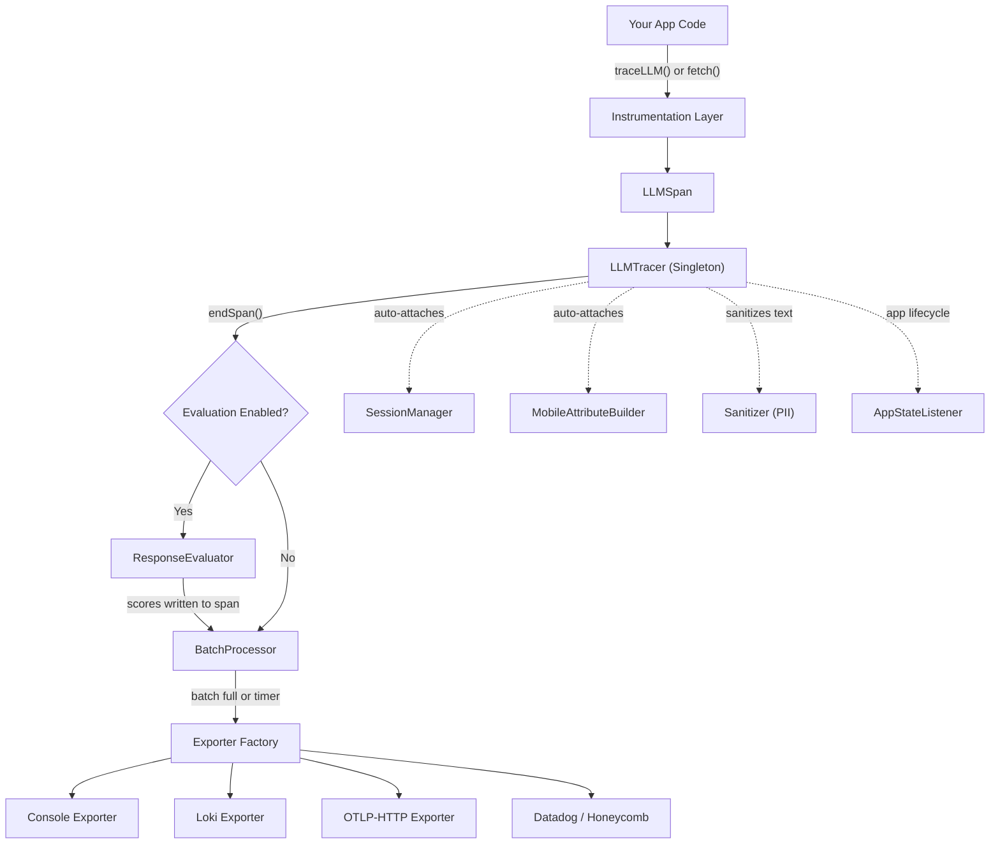
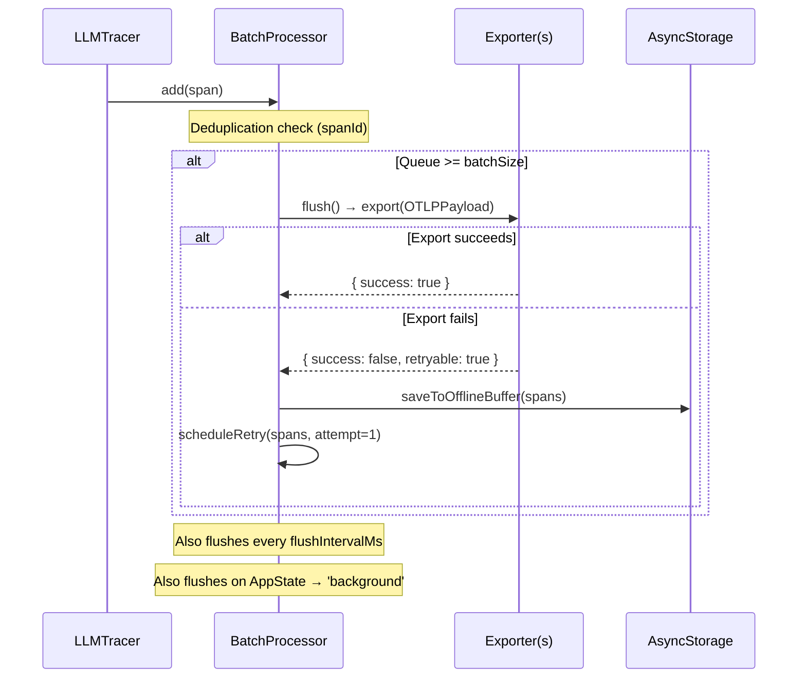
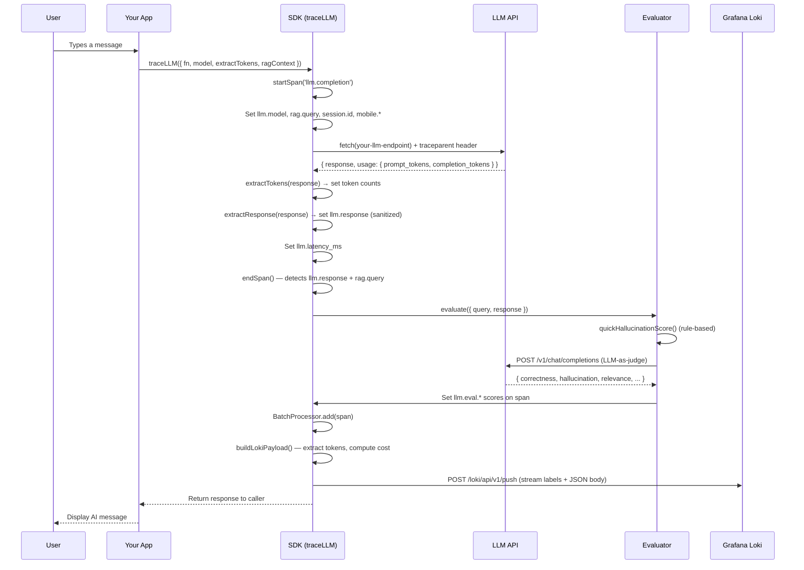

# @llm-telemetry/react-native

> **Version:** 1.0.0 · **Platform:** React Native (iOS & Android) · **Language:** TypeScript

You can use this SDK to capture, evaluate, and export telemetry from LLM-powered mobile apps. It records latency, token usage, cost, and AI quality scores — then pushes everything to Grafana Loki (or any OpenTelemetry-compatible backend) so you get a real-time observability dashboard out of the box.

---

## Table of contents

- [Prerequisites](#prerequisites)
- [Installation](#installation)
- [Initialization](#initialization)
- [Trace your LLM calls](#trace-your-llm-calls)
- [Auto-instrumentation](#auto-instrumentation)
- [Import the Grafana dashboard](#import-the-grafana-dashboard)
- [What gets logged](#what-gets-logged)
- [Architecture overview](#architecture-overview)
- [Module breakdown](#module-breakdown)
- [How data is collected](#how-data-is-collected)
- [What data the SDK captures](#what-data-the-sdk-captures)
- [What data your app provides](#what-data-your-app-provides)
- [Evaluation pipeline](#evaluation-pipeline)
- [Export pipeline](#export-pipeline)
- [Loki log format](#loki-log-format)
- [Data flow diagram](#data-flow-diagram)
- [Supported models](#supported-models)
- [API reference](#api-reference)
- [Configuration reference](#configuration-reference)
- [Validate your setup](#validate-your-setup)
- [Troubleshoot common issues](#troubleshoot-common-issues)
- [Use an AI agent for integration](#use-an-ai-agent-for-integration)

---

## Prerequisites

- React Native 0.70+ (Expo or bare workflow)
- TypeScript 4.7+
- A running Grafana Loki instance (or any OTel-compatible backend)
- *(Optional)* An OpenAI-compatible API key if you want LLM-as-judge evaluation

---

## Installation

1. Install the package:

```bash
npm install @llm-telemetry/react-native
```

2. If you use `@react-native-async-storage/async-storage` for session persistence, install it as a peer dependency:

```bash
npm install @react-native-async-storage/async-storage
```

---

## Initialization

Call `initTelemetry()` once at app startup. This configures the tracer, exporter, session manager, and evaluator.

```typescript
import { initTelemetry } from '@llm-telemetry/react-native';

// Initialize the SDK to send traces to Loki with LLM-as-judge evaluation.
const { tracer, traceLLM, installFetchInterceptor } = await initTelemetry({
    // Where to send data — 'loki', 'otlp-http', 'console', 'multi', etc.
    exporterType: 'loki',

    // Your Loki push API endpoint
    lokiUrl: 'https://your-loki-instance.example.com',

    // Identifies your app in the dashboard
    appId: 'your-app-id',
    environment: 'production',

    // Optional: enable LLM-as-judge evaluation scoring
    evaluationEnabled: true,
    evaluationApiKey: process.env.EXPO_PUBLIC_LLM_EVAL_KEY,
    evaluationModel: 'gpt-4o-mini',
});
```

If you prefer a dedicated setup file, create `lib/telemetry.ts`:

```typescript
// lib/telemetry.ts — call setupTelemetry() once from your root layout or App.tsx
import { initTelemetry, traceLLM } from '@llm-telemetry/react-native';
export { traceLLM };

export async function setupTelemetry() {
    await initTelemetry({
        exporterType: 'loki',
        lokiUrl: 'https://your-loki-instance.example.com',
        appId: 'your-app-id',
        environment: __DEV__ ? 'development' : 'production',
        evaluationEnabled: true,
        evaluationApiKey: process.env.EXPO_PUBLIC_LLM_EVAL_KEY,
        batchSize: __DEV__ ? 1 : 5,
    });
}
```

Then in your root component:

```typescript
// app/_layout.tsx (Expo Router) or App.tsx
import { useEffect } from 'react';
import { setupTelemetry } from '../lib/telemetry';

export default function RootLayout() {
    useEffect(() => {
        setupTelemetry();
    }, []);
    // ...
}
```

### What happens during initialization

When you call `initTelemetry()`, the SDK performs these steps:

1. **Creates the exporter** — instantiates the backend(s) you specified (Loki, OTLP-HTTP, console, etc.).
2. **Creates the batch processor** — sets up the span queue, flush timer, and retry logic.
3. **Initializes session manager** — loads or creates a session ID (4-hour expiry) via AsyncStorage.
4. **Initializes sanitizer** — configures PII stripping patterns and max prompt length.
5. **Initializes mobile attribute builder** — reads device info (platform, OS version, app version).
6. **Initializes evaluator** — configures the LLM-as-judge grading pipeline (if enabled).
7. **Starts app state listener** — hooks into React Native's `AppState` to flush on background and retry on foreground.

---

## Trace your LLM calls

Wrap any async function that calls an LLM with `traceLLM()`. You provide callback functions to extract data from the response.

```typescript
import { traceLLM } from '@llm-telemetry/react-native';

// traceLLM wraps your function, measures latency, extracts tokens, and queues the span.
const data = await traceLLM({
    // Your actual LLM API call — return the parsed response object
    fn: async () => {
        const res = await fetch('https://api.openai.com/v1/chat/completions', {
            method: 'POST',
            headers: {
                Authorization: `Bearer ${apiKey}`,
                'Content-Type': 'application/json',
            },
            body: JSON.stringify({
                model: 'gpt-4o',
                messages: [{ role: 'user', content: userMessage }],
            }),
        });
        return res.json();
    },

    // Model name — used for cost calculation and dashboard labels
    model: 'gpt-4o',

    // Extract the AI reply text from your response shape
    extractResponse: (r) => r.choices[0].message.content,

    // Extract token counts from the response's usage object
    extractTokens: (r) => ({
        promptTokens: r.usage.prompt_tokens,
        completionTokens: r.usage.completion_tokens,
    }),

    // Optional: provide the user's query to trigger evaluation scoring
    ragContext: { query: userMessage },
});
```

> **Important:** If you don't provide `extractTokens`, the span will have zero token counts — meaning `tokens_total` and `cost_total_usd` will be 0 in your dashboard. Make sure your backend returns usage data.

---

## Auto-instrumentation

If you prefer zero-code instrumentation, `installFetchInterceptor()` automatically detects and traces outgoing `fetch()` calls to known LLM endpoints:

```typescript
// Intercepts fetch calls to OpenAI, Anthropic, Google, Cohere, Mistral, and more
const uninstall = installFetchInterceptor(tracer, {
    additionalPatterns: ['your-api.example.com/v1/chat'],  // add your own endpoints
    captureRequestBody: true,
    captureResponseBody: true,
    injectTraceHeaders: true,  // injects W3C traceparent headers
});
```

**Built-in URL patterns detected:**

| Provider | URL pattern | Span name |
|----------|-------------|-----------|
| OpenAI | `api.openai.com/v1/chat/completions` | `llm.chat_completion` |
| OpenAI | `api.openai.com/v1/embeddings` | `llm.embedding` |
| Anthropic | `api.anthropic.com/v1/messages` | `llm.chat_completion` |
| Google | `generativelanguage.googleapis.com` | `llm.chat_completion` |
| Cohere | `api.cohere.ai/v1/chat` | `llm.chat_completion` |
| Mistral | `api.mistral.ai/v1/chat/completions` | `llm.chat_completion` |
| Together AI | `api.together.xyz/v1/chat/completions` | `llm.chat_completion` |
| OpenRouter | `openrouter.ai/api/v1/chat/completions` | `llm.chat_completion` |
| Generic | `*/v1/chat/completions` | `llm.chat_completion` |

> If both `traceLLM()` and `installFetchInterceptor()` are active, `traceLLM()` takes priority — the fetch interceptor skips requests already being traced.

---

## Import the Grafana dashboard

The SDK ships a pre-built Grafana dashboard JSON. You can import it to get up and running quickly.

### Manual import

1. Copy `grafana/dashboard.json` from the installed package.
2. In Grafana, go to **Dashboards** → **Import** → paste the JSON.

---

## What gets logged

Each request produces **one** Loki log entry with these fields:

| Field | Description |
|---|---|
| `tokens_prompt` / `tokens_completion` / `tokens_total` | Token counts |
| `cost_total_usd` | Estimated USD cost (auto-calculated from model pricing) |
| `pipeline_duration_ms` | End-to-end latency in milliseconds |
| `evaluation_scores_correctness` | LLM-as-judge correctness score (0–1) |
| `evaluation_scores_relevance` | Relevance score (0–1) |
| `evaluation_scores_hallucination` | Hallucination risk (0–1, lower is better) |
| `evaluation_scores_helpfulness` | Helpfulness score (0–1) |
| `evaluation_scores_coherence` | Coherence score (0–1) |
| `evaluation_scores_overall` | Weighted average score |
| `eval_triggered` | `"true"` / `"false"` — Loki stream label for filtering |

---

## Architecture overview



The SDK is a self-contained observability pipeline for LLM-powered mobile apps:

1. **Captures** — wraps LLM API calls to record latency, tokens, cost, model, prompts, and responses.
2. **Evaluates** — optionally runs a 2-stage evaluation pipeline (rule-based hallucination pre-score → LLM-as-judge grading).
3. **Enriches** — automatically attaches mobile device info, session identity, and PII-sanitized text.
4. **Exports** — batches spans into OTel-compatible payloads and pushes them to one or more backends.

> The SDK never throws. Every operation is wrapped in `try/catch` with silent fallback. Telemetry failures never crash your app.

---

## Module breakdown

The SDK has **36 source files** organized into **9 modules**:

| Module | Files | Purpose |
|--------|-------|---------|
| `core/` | `tracer.ts`, `span.ts`, `id.ts`, `clock.ts`, `context.ts` | Singleton tracer, span lifecycle, ID generation, W3C trace context |
| `types/` | `index.ts` | All TypeScript interfaces, enums, OTLP payload types |
| `attributes/` | `semantic.ts`, `llm.ts`, `mobile.ts`, `rag.ts` | Semantic attribute constants (OpenTelemetry GenAI conventions) |
| `instrumentation/` | `generic-llm.ts`, `fetch-interceptor.ts`, `openai.ts`, `anthropic.ts`, `rag-pipeline.ts` | Three instrumentation methods for capturing LLM calls |
| `evaluation/` | `evaluator.ts`, `grader.ts`, `hallucination.ts`, `grounding.ts`, `prompts.ts` | 2-stage evaluation: rule-based + LLM-as-judge |
| `export/` | `loki.ts`, `console.ts`, `otlp-http.ts`, `otlp-grpc.ts`, `datadog.ts`, `honeycomb.ts`, `multi.ts`, `batch-processor.ts`, `exporter.ts`, `enriched-log.ts` | 8 exporter backends + batch processor + factory |
| `cost/` | `pricing.ts` | Token-based USD cost calculation with per-model pricing |
| `session/` | `session-manager.ts`, `app-state-listener.ts` | Session identity (4-hour timeout), background/foreground lifecycle |
| `sanitizer/` | `sanitizer.ts` | PII stripping (emails, phones, SSNs, API keys) + text truncation |

---

## How data is collected

You can choose one of three instrumentation methods — or combine them.

### Method 1: `traceLLM()` — manual wrapper (recommended)

You wrap any async function with a span and provide callback functions to extract data from the response. See [Trace your LLM calls](#trace-your-llm-calls) above for a complete example.

**What it does internally:**

1. Calls `tracer.startSpan('llm.completion')` — creates an `LLMSpan`.
2. Auto-attaches: `llm.model`, `llm.provider`, `llm.streaming`, `session.id`, `mobile.*` attributes.
3. Calls your `fn()` — your actual LLM API call.
4. After `fn()` resolves: measures `llm.latency_ms`, calls your `extractTokens()`, `extractResponse()`, `extractToolCalls()` callbacks to populate the span.
5. Sanitizes prompt and response text via the PII sanitizer.
6. Calls `tracer.endSpan(span)` — this triggers evaluation (if enabled) and queues the span for export.

### Method 2: `installFetchInterceptor()` — auto-instrumentation

See [Auto-instrumentation](#auto-instrumentation) above. The interceptor monkey-patches `globalThis.fetch()` and parses request/response bodies for token usage, model names, and response text.

### Method 3: `RAGPipeline` — multi-stage tracing

If your app performs the RAG pipeline client-side, you can create a tree of child spans:

```typescript
import { RAGPipeline } from '@llm-telemetry/react-native';

const pipeline = new RAGPipeline({ query: 'events tonight' });

// Each stage creates a child span under the rag.pipeline root
const embedding = await pipeline.traceEmbedding(() => embed(query));
const results = await pipeline.traceVectorSearch(() => search(embedding));
const { contextString } = pipeline.traceContextBuild(results);
const answer = await pipeline.traceLLMCompletion(() => llm(contextString));

// End the root span — triggers evaluation and export
pipeline.end();
```

---

## What data the SDK captures

### Data captured automatically

| Data point | Attribute key | Source |
|-----------|---------------|--------|
| Latency | `llm.latency_ms` | `Date.now()` diff |
| Session ID | `session.id` | Generated UUID, persisted via AsyncStorage |
| Message count | `session.message_count` | Incremented per `endSpan()` call |
| Platform | `mobile.platform` | React Native `Platform.OS` |
| OS version | `mobile.os_version` | React Native `Platform.Version` |
| App version | `mobile.app_version` | Expo Constants or manual config |
| Device model | `mobile.device_model` | React Native device info |
| Trace ID | `traceId` | Crypto random 32-hex chars |
| Span ID | `spanId` | Crypto random 16-hex chars |
| W3C traceparent | Outgoing HTTP header | Computed from trace/span IDs |
| PII sanitization | Applied to `llm.prompt`, `llm.response` | Regex patterns for email, phone, SSN, API keys |
| Cost (USD) | Calculated from tokens × pricing | Built-in pricing map |
| Eval scores | `llm.eval.correctness`, `llm.eval.hallucination`, etc. | Evaluator pipeline |

### Data captured from LLM responses

| Data point | Attribute key | Source |
|-----------|---------------|--------|
| Prompt tokens | `llm.prompt_tokens` | Response body `usage.prompt_tokens` |
| Completion tokens | `llm.completion_tokens` | Response body `usage.completion_tokens` |
| Model (actual) | `llm.model` | Response body `model` field |
| Finish reason | `llm.finish_reason` | Response body `choices[0].finish_reason` |
| Request ID | `llm.request_id` | Response body `id` |
| Response text | `llm.response` | Response body (provider-specific extraction) |
| Tool calls | `llm.tool_calls` | Response body `tool_calls` |

---

## What data your app provides

Your app is responsible for providing data the SDK cannot infer automatically.

### Data provided at initialization

| Data | Config key | Example | Purpose |
|------|-----------|---------|---------|
| Export backend | `exporterType` | `'loki'` | Where to send data |
| Loki URL | `lokiUrl` | `'https://your-loki.example.com'` | Loki push API endpoint |
| OTLP collector URL | `collectorUrl` | `'https://your-otel-collector.example.com'` | Generic OTel endpoint |
| App ID | `appId` | `'my-app'` | Loki stream label |
| Environment | `environment` | `'production'` | Loki stream label |
| API key | `apiKey` | `'...'` | Auth for exporter |
| Evaluation config | `evaluationEnabled`, `evaluationApiKey` | `true`, `'sk-...'` | LLM-as-judge grading |
| Privacy config | `sanitizePrompts`, `stripPII` | `true`, `true` | PII scrubbing |
| Sample rate | `sampleRate` | `1.0` (dev), `0.2` (prod) | Percentage of traces to keep |

### Data provided per LLM call

| Data | `traceLLM` option | Example | Purpose |
|------|-------------------|---------|---------|
| The LLM call | `fn` | `async () => fetch(...)` | The function to trace |
| Model name | `model` | `'gpt-4o'` | Cost calculation + labels |
| Response extractor | `extractResponse` | `(r) => r.message` | Gets the AI reply |
| Token extractor | `extractTokens` | `(r) => ({ promptTokens: ... })` | Gets token counts |
| RAG query | `ragContext.query` | `userMessage` | Triggers evaluation |
| RAG documents | `ragContext.documents` | Array of retrieved docs | Fed to hallucination scorer |

---

## Evaluation pipeline

Evaluation runs automatically when `tracer.endSpan()` detects that a span has both `llm.response` AND (`rag.query` OR `llm.prompt`) set as attributes.

### Stage 1: rule-based hallucination pre-score

If `rag.documents` (retrieved documents) are available, the SDK runs a local, zero-API-call hallucination check:

1. **Token overlap** (60% weight): checks what percentage of response words appear in retrieved documents.
2. **Claim grounding** (40% weight): extracts factual claims (numbers, dates, proper nouns) and checks which appear in the documents.

Sets `llm.eval.hallucination` as a 0–1 score (higher = more hallucinated).

### Stage 2: LLM-as-judge grading

If you configured `evaluationApiKey`, the SDK calls an OpenAI-compatible endpoint with a structured evaluation prompt. A 10-second timeout prevents slow graders from blocking span export.

**Scores produced (all 0–1):**

| Score | Attribute | Meaning |
|-------|-----------|---------)|
| Correctness | `llm.eval.correctness` | Did the AI answer accurately? |
| Hallucination | `llm.eval.hallucination` | How much was fabricated? (higher = worse) |
| Relevance | `llm.eval.relevance` | Were results relevant to the query? |
| Helpfulness | `llm.eval.helpfulness` | Was the response actionable? |
| Coherence | `llm.eval.coherence` | Was it well-structured? |
| Grounding | `llm.eval.grounding` | Was it grounded in retrieved documents? |

> The grader uses `X-LLM-Telemetry-Internal: true` to prevent the fetch interceptor from instrumenting it (which would cause infinite recursion).

---

## Export pipeline

### Batch processor flow



**Reliability features:**

- **Deduplication**: tracks seen `spanId`s (up to 1,000) to prevent re-export
- **Queue overflow**: drops oldest span if queue exceeds `maxQueueSize`
- **Exponential backoff retry**: 1s → 2s → 4s (max 3 retries)
- **Offline buffer**: failed spans are persisted to AsyncStorage and retried when your app returns to foreground

### Available exporters

| Backend | Config value | Sends to | Use case |
|---------|-------------|----------|----------|
| Console | `'console'` | Metro debugger logs | Development only |
| Loki | `'loki'` | Grafana Loki push API | Production dashboards |
| OTLP-HTTP | `'otlp-http'` | Any OTel-compatible collector | Jaeger, Tempo, SigNoz, etc. |
| OTLP-gRPC | `'otlp-grpc'` | Any OTel-compatible collector | gRPC-based collectors |
| Datadog | `'datadog'` | Datadog APM | Datadog users |
| Honeycomb | `'honeycomb'` | Honeycomb API | Honeycomb users |
| Multi | `'multi'` | Console + Loki (+ others if configured) | Dev + production together |

You can route data to **any OTLP-compliant backend** using the `'otlp-http'` exporter. Set `collectorUrl` to your collector's traces endpoint (e.g., `https://your-otel-collector.example.com/v1/traces`). This works with Jaeger, Grafana Tempo, SigNoz, Prometheus (via spanmetrics), Grafana Cloud, and any other OpenTelemetry-compatible backend.

---

## Loki log format

### Stream labels (indexed)

```json
{
    "job": "llm-telemetry",
    "app": "your-app-id",
    "platform": "ios",
    "env": "production",
    "model": "gpt-4o",
    "eval_triggered": "true"
}
```

### JSON log body (non-indexed)

```json
{
    "event": "llm_trace",
    "trace_id": "a1b2c3d4...",
    "timestamp": "2026-03-13T17:30:00.000Z",
    "tokens_total": 1847,
    "tokens_prompt": 1200,
    "tokens_completion": 647,
    "cost_total_usd": 0.0095,
    "pipeline_duration_ms": 8230,
    "rag_query": "find me jazz events tonight",
    "eval_triggered": "true",
    "evaluation_scores_correctness": 0.85,
    "evaluation_scores_hallucination": 0.12,
    "evaluation_scores_relevance": 0.91,
    "evaluation_scores_overall": 0.88,
    "model": "gpt-4o",
    "platform": "ios"
}
```

### Token extraction logic

The Loki exporter scans **all spans in the trace** for token data using multiple attribute names:

```
llm.prompt_tokens || llm.total_prompt_tokens || gen_ai.usage.prompt_tokens
llm.completion_tokens || llm.total_completion_tokens || gen_ai.usage.completion_tokens
llm.total_tokens || llm.tokens_total || gen_ai.usage.total_tokens
```

If the aggregate total is still 0, it computes `tokensTotal = tokensPrompt + tokensCompletion`.

---

## Data flow diagram



---

## Supported models

Cost is calculated as: `(promptTokens / 1M) × inputPrice + (completionTokens / 1M) × outputPrice`

| Model | Input ($/1M tokens) | Output ($/1M tokens) |
|-------|---------------------|----------------------|
| `gpt-4o` | $2.50 | $10.00 |
| `gpt-4o-mini` | $0.15 | $0.60 |
| `gpt-4.1` | $2.00 | $8.00 |
| `gpt-4.1-mini` | $0.40 | $1.60 |
| `gpt-4.1-nano` | $0.10 | $0.40 |
| `gpt-4-turbo` | $10.00 | $30.00 |
| `o4-mini` | $1.10 | $4.40 |
| `claude-4-sonnet` | $3.00 | $15.00 |
| `claude-3.7-sonnet` | $3.00 | $15.00 |
| `claude-3-5-sonnet` | $3.00 | $15.00 |
| `claude-3-5-haiku` | $0.80 | $4.00 |
| `gemini-2.5-pro` | $1.25 | $10.00 |
| `gemini-2.5-flash` | $0.15 | $0.60 |
| `gemini-2.0-flash` | $0.10 | $0.40 |
| `unknown` (fallback) | $2.50 | $10.00 |

**Model lookup chain:** exact match → strip date suffix (e.g., `-2024-08-06`) → prefix match → `unknown` fallback.

Unrecognized models fall back to GPT-4o pricing with a dev-mode warning.

---

## API reference

### Public functions

| Function | Signature | Purpose |
|----------|-----------|---------|-
| `initTelemetry` | `(config: LLMTelemetryConfig) → Promise<{ tracer, traceLLM, ... }>` | One-liner setup |
| `traceLLM` | `<T>(options: TraceLLMOptions<T>) → Promise<T>` | Wrap any LLM call |
| `installFetchInterceptor` | `(tracer, options?) → () => void` | Auto-instrument `fetch()` calls |
| `computeCost` | `(model, prompt, completion) → CostResult` | Calculate USD cost |
| `buildEnrichedLog` | `(spans, config?) → EnrichedTraceLog` | Build structured log from spans |

### Core classes

| Class | Key methods | Purpose |
|-------|-------------|---------|
| `LLMTracer` | `getInstance()`, `init()`, `startSpan()`, `endSpan()`, `flush()`, `shutdown()` | Central singleton |
| `LLMSpan` | `setAttribute()`, `setStatus()`, `recordException()`, `end()`, `toOTLP()` | Individual span |
| `BatchProcessor` | `add()`, `flush()`, `retryOfflineBuffer()`, `shutdown()` | Queue + reliability |
| `RAGPipeline` | `traceEmbedding()`, `traceVectorSearch()`, `traceContextBuild()`, `traceLLMCompletion()`, `end()` | Multi-stage RAG tracing |
| `ResponseEvaluator` | `evaluate(params, span)` | Evaluation orchestrator |
| `SessionManager` | `init()`, `getCurrentSessionId()`, `incrementMessageCount()` | Session identity |
| `Sanitizer` | `sanitize(text)`, `hashString(text)` | PII stripping |

---

## Configuration reference

Full `LLMTelemetryConfig` interface:

| Option | Type | Default | Description |
|--------|------|---------|-------------|
| `exporterType` | `'otlp-http' \| 'loki' \| 'console' \| 'multi' \| ...` | **required** | Backend(s) to export to |
| `collectorUrl` | `string` | — | Primary OTel collector endpoint |
| `lokiUrl` | `string` | — | Loki push API base URL |
| `serviceName` | `string` | `'llm-app'` | OTel resource service name |
| `serviceVersion` | `string` | `'1.0.0'` | OTel resource service version |
| `appId` | `string` | — | Application identifier (Loki label) |
| `environment` | `string` | `'production'` | Deployment environment |
| `apiKey` | `string` | — | Auth key for exporter |
| `headers` | `Record<string,string>` | — | Custom headers for exporter requests |
| `enabled` | `boolean` | `true` | Kill switch for all telemetry |
| `sampleRate` | `number (0-1)` | `1.0` | Percentage of spans to keep |
| `batchSize` | `number` | `10` | Spans per export batch |
| `flushIntervalMs` | `number` | `30000` | Periodic flush interval (ms) |
| `maxQueueSize` | `number` | `100` | Max spans in queue |
| `evaluationEnabled` | `boolean` | `true` | Enable evaluation scoring |
| `evaluationModel` | `string` | `'gpt-4o'` | Model for LLM-as-judge grading |
| `evaluationApiKey` | `string` | — | OpenAI-compatible API key for grading |
| `evaluationEndpoint` | `string` | `'https://api.openai.com/v1/chat/completions'` | Custom grading endpoint |
| `sanitizePrompts` | `boolean` | `true` | Sanitize prompt and response text |
| `maxPromptLength` | `number` | `500` | Max chars for prompt attribute |
| `stripPII` | `boolean` | `true` | Strip email, phone, SSN, API keys |
| `lokiLabels` | `Record<string,string>` | — | Additional Loki stream labels |

---

## Validate your setup

After initializing the SDK and sending a test message, confirm everything is working:

### 1. Check console output

If you set `exporterType: 'console'` or `'multi'`, you should see a formatted trace log in your Metro debugger:

```
🔭 llm_trace [a1b2c3d4]
┌─ LLM TRACE ──────────────────────────────────────────┐
│ Trace:    a1b2c3d45678...                             │
│ Query:    "find jazz events tonight"                  │
│ Duration: 2340ms  │  Iterations: 1                    │
├─ TOKENS ──────────────────────────────────────────────┤
│ Prompt: 1200  │  Completion: 647  │  Total: 1847      │
├─ COST ────────────────────────────────────────────────┤
│ $0.009500 USD  (gpt-4o)                               │
├─ EVALUATION ──────────────────────────────────────────┤
│ Correctness:   0.85  ████████░░                       │
│ Hallucination: 0.12  █░░░░░░░░░  ✓ Clean             │
│ Relevance:     0.91  █████████░                       │
│ Overall:       0.88  ████████░░                       │
└───────────────────────────────────────────────────────┘
```

### 2. Query Loki directly

```bash
curl -s 'http://your-loki:3100/loki/api/v1/query_range?query={job="llm-telemetry"}&limit=1&direction=backward' \
  | python3 -c "
import sys, json
data = json.load(sys.stdin)
entry = json.loads(data['data']['result'][0]['values'][0][1])
print(f\"tokens: {entry['tokens_total']} | cost: \${entry['cost_total_usd']} | eval: {entry['eval_triggered']}\")
"
```

Expected output: `tokens: 1847 | cost: $0.0095 | eval: true`

---

## Troubleshoot common issues

| Symptom | Cause | Fix |
|---------|-------|-----|
| `tokens_total` is 0 | Your backend doesn't return usage data in the response body | Add `usage: { prompt_tokens, completion_tokens }` to your API response. Provide an `extractTokens` callback to `traceLLM()`. |
| `cost_total_usd` is 0 | Token count is 0 (see above), or the model name is unrecognized | Fix token extraction first. If you use a custom model name, it falls back to GPT-4o pricing. |
| `eval_triggered` is `"false"` | Evaluation conditions not met | Ensure your span has both `llm.response` AND `rag.query` (or `llm.prompt`) set. Check that `evaluationEnabled: true` and `evaluationApiKey` are configured. |
| Two logs per request | Both `traceLLM()` and `installFetchInterceptor()` are active | This is already handled — `traceLLM()` sets a flag that causes the fetch interceptor to skip. If you still see duplicates, update to the latest SDK version. |
| Network timeout errors | Your Loki or OTel endpoint is unreachable | Verify `lokiUrl` or `collectorUrl` is correct and accessible from your device/simulator. Check for firewall or CORS issues. |
| No console output | Exporter type doesn't include console | Set `exporterType: 'multi'` or `'console'` for development. |
| `evaluationApiKey` errors | Invalid or missing API key | Verify your OpenAI-compatible API key. The SDK logs a dev-mode warning if the grading call fails. |

---

## Use an AI agent for integration

If you use an AI coding agent (Cursor, GitHub Copilot, Windsurf, etc.), paste the following prompt to have it integrate the SDK into your project:

```
Integrate the @llm-telemetry/react-native SDK into this project. Follow these steps:

1. Install the package: `npm install @llm-telemetry/react-native`

2. Create a file `lib/telemetry.ts` that exports a `setupTelemetry()` function calling
   `initTelemetry()` with these settings:
   - exporterType: 'loki' (or 'otlp-http' if I use a different backend)
   - lokiUrl: [ask me for my Loki endpoint URL]
   - appId: [use the app name from package.json]
   - environment: __DEV__ ? 'development' : 'production'
   - evaluationEnabled: true
   - evaluationApiKey: process.env.EXPO_PUBLIC_LLM_EVAL_KEY
   - batchSize: __DEV__ ? 1 : 5

3. Call `setupTelemetry()` once in the root layout or App.tsx using a useEffect hook.

4. Find every place in the codebase where an LLM API call is made (fetch to OpenAI,
   Anthropic, Supabase edge functions, etc.) and wrap each one with `traceLLM()`:
   - Set `model` to the model name being used
   - Set `extractResponse` to pull the AI reply text from the response
   - Set `extractTokens` to pull prompt_tokens and completion_tokens from the response
   - Set `ragContext.query` to the user's input message (this triggers evaluation)

5. Do NOT install the fetch interceptor if all calls are already wrapped with traceLLM().

6. After making changes, verify the app builds and runs without errors.

Constraints:
- The SDK must never throw or crash the app — all telemetry is wrapped in try/catch.
- Do not modify any existing UI components or styles.
- Do not change the app's behavior — only add observability.
```

---

## Safety guarantees

- **Never throws** — all telemetry is wrapped in `try/catch`
- **Never blocks the UI** — tracing runs in the background after `fn()` returns your data
- **10-second grading timeout** — slow LLM-as-judge calls don't block span export
- **No duplicate logs** — `traceLLM()` and the fetch interceptor coordinate to emit exactly one log per request
- **PII protection** — emails, phone numbers, SSNs, and API keys are automatically stripped from prompts and responses
